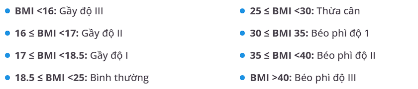

# 🔍 Bài Tập: Cấu Trúc Rẽ Nhánh (If-Else)

## 🚀 Mục Tiêu
Học cách sử dụng câu lệnh điều kiện `if-else` trong Java thông qua các bài tập từ cơ bản đến nâng cao.

---

## 📋 Danh Sách Bài Tập

1. [Kiểm tra số chẵn hay lẻ](#1--kiểm-tra-số-chẵn-hay-lẻ)
2. [So sánh hai số](#2--so-sánh-hai-số)
3. [Xác định độ tuổi](#3--xác-định-độ-tuổi)
4. [Kiểm tra năm nhuận](#4--kiểm-tra-năm-nhuận)
5. [Tìm số lớn nhất trong ba số](#5--tìm-số-lớn-nhất-trong-ba-số)
6. [Kiểm tra ký tự nguyên âm](#6--kiểm-tra-ký-tự-nguyên-âm)
7. [Kiểm tra chia hết](#7--kiểm-tra-chia-hết)
8. [Xếp loại học sinh](#8--xếp-loại-học-sinh)
9. [Kiểm tra số âm, dương, hay bằng 0](#9--kiểm-tra-số-âm-dương-hay-bằng-0)
10. [Máy tính đơn giản](#10--máy-tính-đơn-giản)

---

### 1. 🔢 Kiểm tra số chẵn hay lẻ
- **Mô tả**: Viết chương trình kiểm tra xem một số nguyên nhập vào có phải là số chẵn hay lẻ.  
- **Input**: `n = 7`  
- **Output**: `Số 7 là số lẻ.`
- **🧑‍💻 Xem source code tại: [Source code bài 1](./BrachingStructure/Bai01.java)**

### 2. ⚖️ So sánh hai số
- **Mô tả**: Viết chương trình so sánh hai số nguyên nhập vào từ bàn phím.
- **Input**: a = 10, b = 20
- **Output**: Số 20 lớn hơn số 10.
- **🧑‍💻 Xem source code tại: [Source code bài 2](./BrachingStructure/Bai02.java)**

### 3. 🧑‍🍼 Xác định độ tuổi
- `Mô tả`: Phân loại độ tuổi dựa trên các khoảng sau:
    - `0-12`: Trẻ em.
    - `13-19`: Thiếu niên.
    - `20-59`: Người lớn.
    - `60+`: Người cao tuổi.
- `Input`: age = 25
- `Output`: Bạn thuộc nhóm người lớn.
- **🧑‍💻 Xem source code tại: [Source code bài 3](./BrachingStructure/Bai03.java)**

### 4. 📅 Kiểm tra năm nhuận

- `Mô tả`: Viết chương trình kiểm tra xem một năm có phải là năm nhuận không.
- `Input`: `year = 2024`
- `Output`: Năm `2024` là năm nhuận.
- **🧑‍💻 Xem source code tại: [Source code bài 4](./BrachingStructure/Bai04.java)**

### 5. 🥇 Tìm số lớn nhất trong ba số

- `Mô tả`: Viết chương trình tìm số lớn nhất trong ba số nguyên nhập vào.
- `Input`: `a = 10, b = 20, c = 15`
- `Output`: Số lớn nhất là 20.
- **🧑‍💻 Xem source code tại: [Source code bài 5](./BrachingStructure/Bai05.java)**

### 6. 🅰️ Kiểm tra ký tự nguyên âm

- `Mô tả`: Viết chương trình kiểm tra xem một ký tự nhập vào có phải là nguyên âm (a, e, i, o, u) hay không.
- `Input`: ch = 'e'
- `Output`: Ký tự 'e' là nguyên âm.
- **🧑‍💻 Xem source code tại: [Source code bài 6](./BrachingStructure/Bai06.java)**

### 7. ✖️ Kiểm tra chia hết

- `Mô tả`: Viết chương trình kiểm tra xem một số nguyên nhập vào có chia hết cho 5 và 11 hay không.
- `Input`: n = 55
- `Output`: Số 55 chia hết cho 5 và 11.
- **🧑‍💻 Xem source code tại: [Source code bài 7](./BrachingStructure/Bai07.java)**

### 8. 🎓 Xếp loại học sinh

- Mô tả: Viết chương trình xếp loại học sinh dựa trên điểm:
    ```java
    >= 90: Xuất sắc.
    >= 70: Giỏi.
    >= 50: Trung bình.
    < 50: Kém.
    ```
- Input: score = 75
- Output: Học sinh được xếp loại Giỏi.
- **🧑‍💻 Xem source code tại: [Source code bài 8](./BrachingStructure/Bai08.java)**

### 9. ➕ Kiểm tra số âm, dương, hay bằng 0

- `Mô tả`: Viết chương trình kiểm tra xem một số là âm, dương, hay bằng 0.
- `Input`: n = -5
- `Output`: Số -5 là số âm.
- **🧑‍💻 Xem source code tại: [Source code bài 9](./BrachingStructure/Bai09.java)**

### 10. 🖩 Máy tính đơn giản

- `Mô tả`: Viết chương trình thực hiện các phép toán cộng, trừ, nhân, chia dựa trên hai số và một phép toán nhập vào.
- `Input`: a = 10, b = 5, operation = '+'
- `Output`: Kết quả là 15.
- **🧑‍💻 Xem source code tại: [Source code bài 10](./BrachingStructure/Bai10.java)**

### 11. 🏋️ Kiểm tra sức khoẻ người `BMI`

- `Mô tả`: Viết chương trình cho người dùng nhập vào chiều cao và nâng nặng và trả ra kết quả BMI.



- `Input`: Chiều cao `height`, cân nặng `weight`
- `Output`: Mức độ BMI.
- **🧑‍💻 Xem source code tại: [Source code bài 11](./BrachingStructure/Bai11.java)**